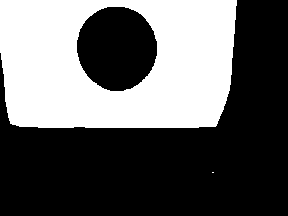
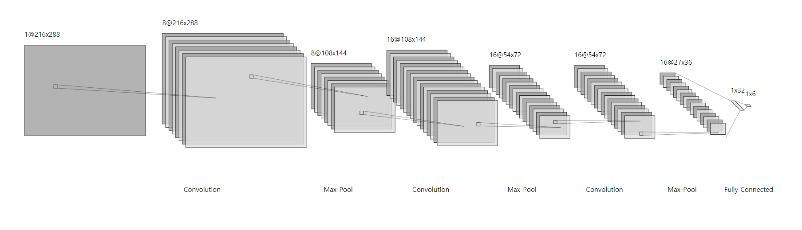
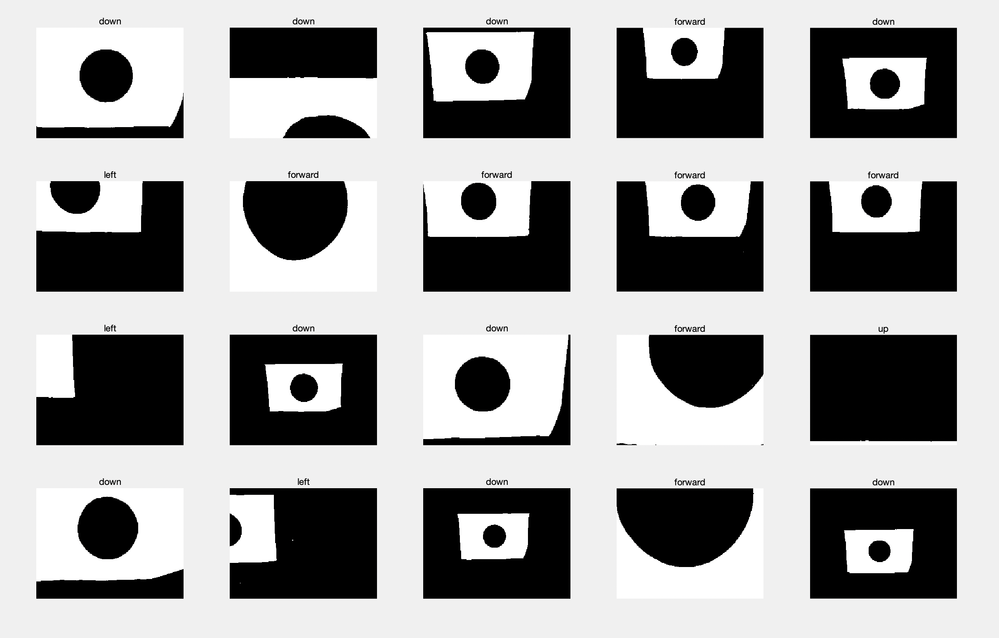
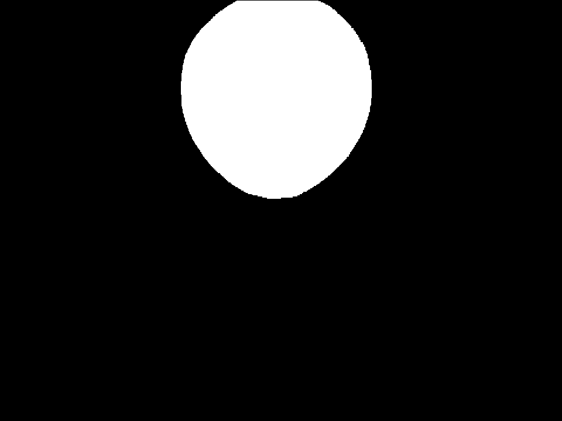
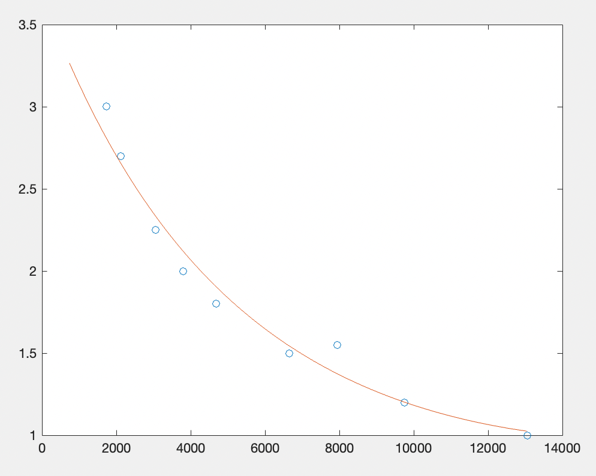
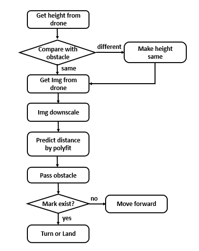
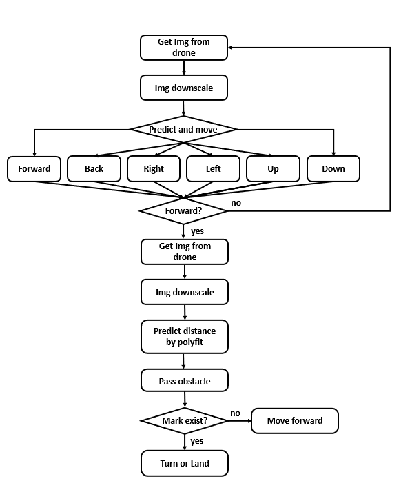

# 2021 Mini-drone Narsha
- CNN, 다항식 곡선 피팅을 활용한 2021 mini-drone 기술 워크샵  

--------------
<목차>

1. [Getting Started](#getting-started)
2. [알고리즘 설명](#알고리즘-설명)
3. [소스코드 설명](#소스코드-설명)
-------------------------

## Getting Started
### 1. Requirments
- [djitello](https://kr.mathworks.com/matlabcentral/fileexchange/74434-matlab-support-package-for-ryze-tello-drones?s_tid=srchtitle)
- [Deep Learning Toolbox Converter for ONNX Model Format](https://kr.mathworks.com/matlabcentral/fileexchange/67296-deep-learning-toolbox-converter-for-onnx-model-format)

### 2. File structure
├── cnn                 
│       └── model: drone_cnn.onnx       
├── regression                                         
│       ├── 다항식 곡선 피팅: step1_p2.xls        
│       ├── 다항식 곡선 피팅: step2_p3.xls             
│       └── 다항식 곡선 피팅: step3_p3.xls                 
└── main.m                 

### 3. 대회진행 전략

1. 본 대회에서 제공하는 맵은 장애물이 x,y,z축 상에서 고정되지 않고 변동이 가능하여, 장애물의 위치에 대한 수많은 다양성이 존재한다.        장애물의 중점과 같은 좌표값을 찾는 방식의 경우, 특정 상황에서만 적용 가능하기에 발생할 수 있는 모든 경우를 대처하기에는 제한적인 방식이라고 판단하였다.        따라서 장애물의 중점을 구체적인 좌표값으로 찾지 않고, 여러 상황에 대해서 처리가 가능한 CNN을 활용하였다.  
	- 최대한 많은 예외상황을 처리할 수 있는 CNN모델을 활용해 드론이 장애물을 바라보는 시점의 frame에서 장애물의 중점으로 이동하기 위한 방향을 얻은 후, 해당 방향으로 tello의 최소 거리 단위만큼 움직이도록 하는 방식을 채택하였다. 	
2. 중점을 찾은 후에 드론이 바라보는 구멍의 크기는 각 단계별로 고정되어 있는 크기이므로, 이에 기반하여, 드론이 장애물을 통과하기 위해 움직여야 하는 거리를 다향식 곡선 피팅을 활용하여 얻었다.
	- 물론 드론이 앞으로 움직이면 일정 거리부터 구멍의 윗부분이 잘리는 상황이 발생하였지만, 모든 1~3m 상황에서 증가되는 크기의 양에는 차이가 있었더라도, 증가되는 경향은 계속 보였기 때문에, 각 거리와 구멍의 크기를 일대일 대응시킬 수 있었다. 

--------------

## 알고리즘 설명

> 여기서 장애물의 중점에 드론이 위치한다는 말은 장애물의 중점과 드론이 동일 축상에 위치한다는 것을 의미한다.

### 1. CNN 모델

> 연산량을 최대한으로 줄이기 위하여 input image는 tello가 얻는 frame을 마스킹 한 후에 추가적으로 0.3배 만큼 줄여서 `[216, 288, 1]`형태를 사용한다.

>결과적으로 드론은 장애물의 중점에 위치되도록 ryze tello drone이 제공하는 6가지 이동방향에 해당하는 `[back, forward, left, right, up, down]` 결론을 내리게 된다.

### 2. 다항식 곡선 피팅
> CNN을 활용하여 장애물의 중점을 찾은 후에는 장애물을 통과하기 위한 moveforward의 distance에 해당하는 값을 알아내야 한다. 

> 이에 대한 부분은, 1,2,3단계 모두 드론이 장애물의 중점에 위치해있다면 구멍의 크기는 고정되어 있는 상황이기 때문에, 이를 고려하여 각 단계의 장애물에서 구멍만을 추출한다. 

> [3, 2.70, 2.25, 2, 1.80, 1.55, 1.50, 1.20, 1]m의 총 9가지 지점에 대한 장애물 구멍의 크기 데이터를 얻은 후, 추출된 구멍의 크기를 이용하여 드론과 장애물 사이의 거리를 예측할 수 있도록 다항식 곡선 피팅을 한다.   

> 드론이 앞으로 움직이면 일정 거리부터 구멍의 윗부분이 잘리는 상황이 발생하였지만, 모든 1~3m 상황에서 증가되는 크기의 양에는 차이가 있었더라도, 증가되는 경향은 계속 보였기 때문에,  데이터의 형태가 지수함수나 이차함수 꼴이라고 생각하고 이를 고려하였다. 각각에 해당하는 오차율을 토대로 분석한 결과 이차함수꼴이 더 타당하다는 결과를 얻을 수 있었다.

### 3. 각 단계별 알고리즘 정리
#### 1) 1단계
> 1단계의 경우에는 장애물의 중점의 높이가 고정되어 있는 상황이므로, 이에 해당하는 높이로 드론을 위치시키고 미리 준비한 다항식 곡선 피팅 값을 활용하여 한번에 장애물을 통과하도록 한다.       
   

>   통과한 후에는 시간을 최대한 줄이기 위하여 표식의 존재여부만을 마스킹을 통하여 확인하고 표식에 해당하는 작업을 시행한다.   

#### 2) 2,3단계
> 2, 3단계의경우에는 장애물의 중점과 드론 사이에 존재하는 변수의 양이 늘어났기 때문에, 이를 CNN을 활용하여 처리한다. 
> 즉, CNN을 통해 드론을 장애물의 중점에 위치시키고,  마찬가지로 각 단계에 해당하여 미리 준비한 다항식 곡선 피팅 값을 활용하여 한번에 장애물을 통과하도록 한다.         
    

> 통과한 후에는 시간을 최대한 줄이기 위하여 표식의 존재여부만을 마스킹을 통하여 확인하고 표식에 해당하는 작업을 시행한다.   

--------------

## 소스코드 설명
#### 1) HSV Transformation and Masking Processing
> 연산량을 줄이기 위해 tello가 얻는 frame을 HSV 색공간으로 변환한 후, 특정 색상만 검출되도록 마스킹 처리한다.
> 장애물의 색상과 표식의 색상에 대해서만 마스킹 처리하였으며, 각 색상에 대한 마스킹 처리는 함수화다. 
<pre>
<code>
function masked_blue = masking_blue(frame)
    hsv = rgb2hsv(frame);
    h = hsv(:,:,1);
    s = hsv(:,:,2);
    v = hsv(:,:,3);

    img = (0.57<h)&(h<0.7)&(0.4<s)&(v>0.3)&(v<0.97);
    masked_blue = imresize(img, 0.3);
end
</code>
</pre>
> 장애물 색상에 해당하는 파란색만 검출되도록 마스킹 처리한다. 마스킹 처리가 완료되면 3차원 배열인 RGB에서 흑백에 해당하는 2차원 배열로 변환되며, 파란색은 백색, 파란색을 제외한 나머지 색상은 흑색으로 인식된다. 
               
	                
<pre>
<code>
function masked_red = masking_red(frame)
    hsv = rgb2hsv(frame);
    h = hsv(:,:,1);
    s = hsv(:,:,2);
    v = hsv(:,:,3);
    masked_red = (0.95<h)+(h<0.1)&(0.4<s)&(v>0.1)&(v<0.97);
end
</code>
</pre>
> 1-2단계 표식에 해당하는 빨간색만 검출되도록 마스킹 처리한다. 마스킹 처리가 완료되면 빨간색은 백색, 빨간색을 제외한 나머지 색상은 흑색으로 인식된다.
                
                     
<pre>
<code>
function masked_purple = masking_purple(frame)
    hsv = rgb2hsv(frame);
    h = hsv(:,:,1);
    s = hsv(:,:,2);
    v = hsv(:,:,3);
    masked_purple = (0.7<h)&(h<0.8)&(0.2<s)&(v>0.1)&(v<0.97);
end
</code>
</pre>
> 3단계 표식에 해당하는 보라색만 검출되도록 마스킹 처리한다. 마스킹 처리가 완료되면 보라색은 백색, 보라색을 제외한 나머지 색상은 흑색으로 인식된다.
                   
		   
#### 2) distance prediction using multiburve fitting
> 장애물의 구멍 크기는 각 단계별로 고정된 값이므로, 이를 기반으로 하여 드론이 장애물을 통과하기 위해 전진해야하는 거리를 예측한다. 거리 예측은 다향식 곡선 피팅을 활용다.
<pre>
<code>
function hole = finding_hole(detect_blue)
    for i=1:288
        detect_blue(1,i)=1;
    end
    for i=1:288
        detect_blue(216,i)=1;
     end
     
    hole = imfill(detect_blue,'holes');
    
    for x=1:216
        for y=1:288
            if detect_blue(x,y)==hole(x,y)
                hole(x,y)=0;
            end
        end
    end
end
</code>
</pre>
> imfill 함수를 통해 장애물의 구멍을 채운 후, 구멍을 채우기 전과 후를 비교한다. 값의 변화가 없으면 0, 있으면 1로 변환하여 구멍에 해당하는 데이터만 얻는다. 

<pre>
<code>
function final_dist = passing_obstacle(hole, p)
    disp(sum(sum(hole)))
    reg_exp = polyval(p, sum(sum(hole)));
    dist = reg_exp;
    final_dist = round(dist,3)+0.4
end
</code>
</pre>
> 다중곡선피팅을 통해 모든 거리에 대해서 드론이 전진해야 할 이동거리를 예측한다.

#### 3) step 1_passing_obstacle
> 1단계 장애물은 장애물의 높이가 고정되어 있고, 좌우 이동이 없기 때문에 CNN을 별도로 사용하지 않는다. 드론의 비행 높이를 장애물 중점의 높이와 일치시키고, 다향식 곡선 피팅을 통해 얻은 거리만큼 전진하여 장애물을 통과한다. 
##### 3-1) step1_find_center
<pre>
<code>
function step1_find_center(myDrone)
    [height, time] = readHeight(myDrone);
    dist_1 = 0.9-height
    if abs(dist_1) > 0.2 
        if dist_1<0
            movedown(myDrone, "Distance", dist_1)
        else
            moveup(myDrone, "Distance", dist_1)
        end
    end
end
</code>
</pre>
> 1단계 장애물의 중점과 드론이 동일 축상에 존재하도록 드론의 비행 높이를 조절한다. 드론이 이륙하고 호버링한 이후에 초기 비행 높이를 height라는 변수에 대입한다.
> 장애물의 중점과 드론이 동일 축상에 존재하기 위해 드론이 상승해야 하는 높이를 찾는다. 1단계 장애물의 중점 높이는 99.5cm이지만 드론이 이동시 흔들릴 때 발생하는 오차를 고려하여 90cm를 중점의 높이로 설정한다. 
> 중점의 높이와 height 간의 차가 양수일 경우에는 드론이 상승하도록 하고, 음수일 경우에는 하강하도록 한다. 

% step 1_passing_obstacle: not using cnn
step1_find_center(myDrone);
frame = snapshot(cam);
masked_blue = masking_blue(frame);
hole = finding_hole(masked_blue);
% f = figure;
% imshow(hole)
% hold on;
final_dist = passing_obstacle(hole, p1)
while final_dist == inf
    moveforward(myDrone, "Distance", 0.2)
    final_dist = passing_obstacle(hole, p1)
end
%예측한 값만큼 드론 전진.
moveforward(myDrone, "Distance", final_dist)
% close(f)
detecting_red(myDrone, cam)
