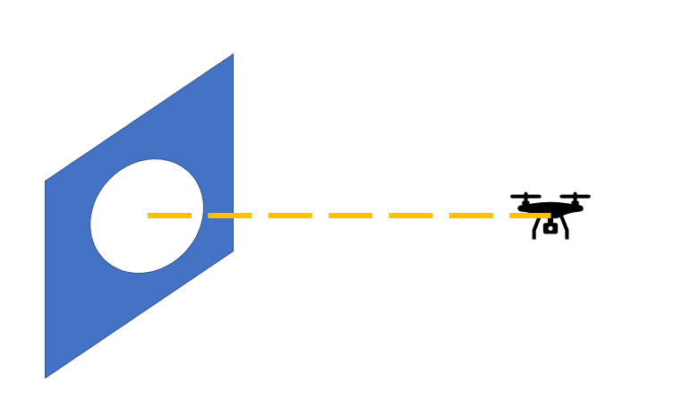
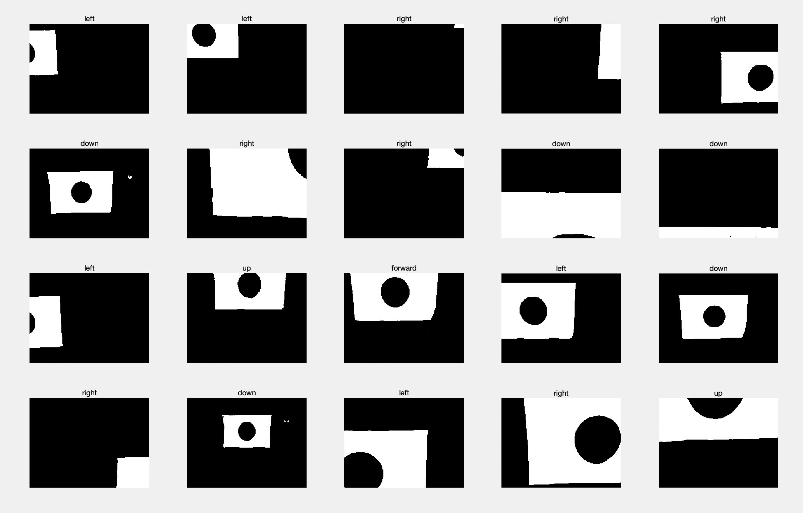
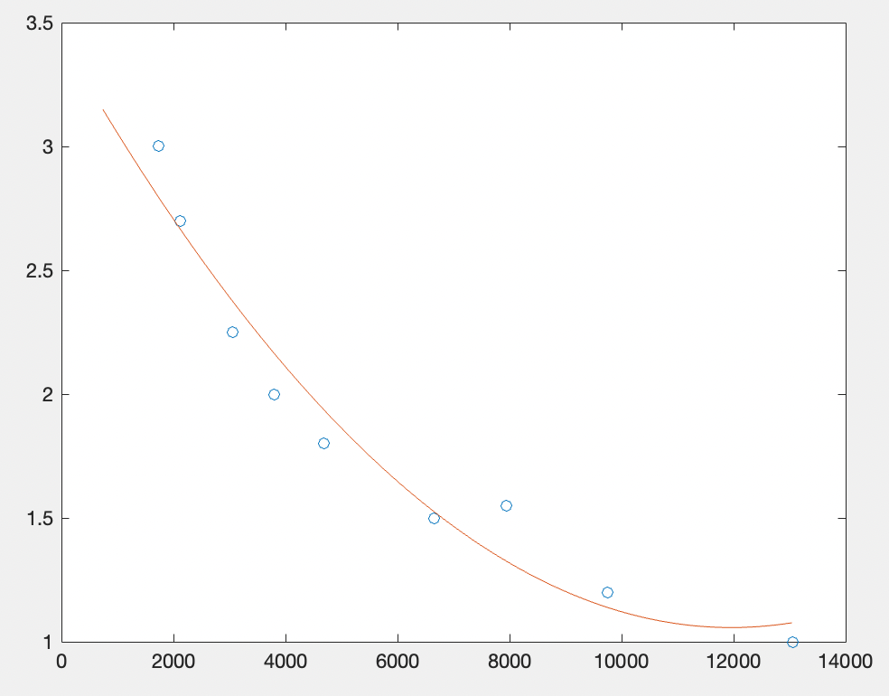

# 2021 Mini-drone Narsha
- CNN, 다항식 곡선 피팅을 활용한 2021 mini-drone 기술 워크샵  

--------------
<목차>

1. [Getting Started](#getting-started)
2. [알고리즘 설명](#알고리즘-설명)
-------------------------

## Getting Started
### 1. Requirments
- [djitello](https://kr.mathworks.com/matlabcentral/fileexchange/74434-matlab-support-package-for-ryze-tello-drones?s_tid=srchtitle)
- [Deep Learning Toolbox Converter for ONNX Model Format](https://kr.mathworks.com/matlabcentral/fileexchange/67296-deep-learning-toolbox-converter-for-onnx-model-format)

### 2. File structure
├── cnn                 
│       └── model: drone_cnn.onnx                     
├── regression                                         
│       ├── 다항식 곡선 피팅: step1_p2.xls        
│       ├── 다항식 곡선 피팅: step2_p3.xls             
│       └──  다항식 곡선 피팅: step3_p3.xls                 
└── main.m                 

### 3. 대회진행 전략

1. 본 대회에서는 장애물의 중점을 구체적인 좌표값으로 찾는 것이 필수적이지 않다고 생각하였다.
	- 이에 최대한 많은 예외상황을 커버할 수 있는 CNN모델을 활용해 드론이 장애물을 바라보는 시점의 frame에서 방향을 얻어 중점에 위치하도록 tello의 최소 거리 단위로 움직이게 하는 방향으로 결정하였다. 	
2. 중점을 찾은 후에 드론이 바라보는 구멍의 크기는 각 단계별로 고정되어 있는 크기이므로, 이에 기반하여, 드론이 장애물을 통과하기 위해 움직여야 하는 거리를 다향식 곡선 피팅을 활용하여 얻었다.
	- 물론 드론이 앞으로 움직이면 일정 거리부터 구멍의 윗부분이 잘리는 상황이 발생하였지만, 모든 1~3m 상황에서 증가되는 크기의 양에는 차이가 있었더라도, 증가되는 경향은 계속 보였기 때문에, 각 거리와 구멍의 크기를 일대일 대응시킬 수 있었다. 

--------------

## 알고리즘 설명

> 여기서 장애물의 중점에 드론이 위치한다는 말은 장애물의 중점과 드론이 동일 축상에 위치한다는 것을 의미한다.

### 1. CNN 모델

> 연산량을 최대한으로 줄이기 위하여 input image는 tello가 얻는 frame을 마스킹 한 후에 추가적으로 0.3배 만큼 줄여서 `[216, 288, 1]`형태를 사용하였다.

>결과적으로 드론은 장애물의 중점에 위치되도록 ryze tello drone이 제공하는 6가지 이동방향에 해당하는 `[back, forward, left, right, up, down]` 결론을 내리게 된다.

### 2. 다항식 곡선 피팅
> CNN을 활용하여  장에믈의 중점을 찾은 후에는 장애물을 통과하기 위한 moveforward의 distance에 해당하는 값을 알아내야 한다. 

> 이에 대한 부분은, 1,2,3단계 모두 드론이 장애물의 중점에 위치해있다면 구멍의 크기는 고정되어 있는 상황이기 때문에, 이를 고려하여 각 단계의 장애물에서 구멍만을 추출하였다. 

> 추출된  구멍의 크기를 이용하여 드론과 장애물 사이의 거리를 예측할 수 있도록  다항식 곡선 피팅을 해주었다.   

> 드론이 앞으로 움직이면 일정 거리부터 구멍의 윗부분이 잘리는 상황이 발생하였지만, 모든 1~3m 상황에서 증가되는 크기의 양에는 차이가 있었더라도, 증가되는 경향은 계속 보였기 때문에,  데이터의 형태가 지수함수나 이차함수 꼴이라고 생각하고 이를 고려하였다. 각각에 해당하는 오차율을 토대로 분석한 결과 이차함수꼴이 더 타당하다는 결과를 얻을 수 있었다.

### 3. 각 단계별 알고리즘 정리
#### 1) 1단계
> 1단계의 경우에는 장애물의 중점의 높이가 고정되어 있는 상황이므로, 이에 해당하는  높이로 드론을 위치시키고 미리 준비한 다항식 곡선 피팅 값을 활용하여 한번에 장애물을 통과하도록 하였다.       
   

>   통과한 후에는 시간을 최대한 줄이기 위하여 표식의 존재여부만을 마스킹을 통하여 확인하고 표식에 해당하는 작업을 시행해주었다.   

#### 2) 2,3단계
> 2, 3단계의경우에는 장애물의 중점과 드론 사이에 존재하는 변수의 양이 늘어났기 때문에, 이를 CNN을 활용하여 처리해주었다. 
> 즉, CNN을 통해 드론을 장애물의 중점에 위치시키고,  마찬가지로 각 단계에 해당하여 미리 준비한 다항식 곡선 피팅 값을 활용하여 한번에 장애물을 통과하도록 하였다. 
    

> 통과한 후에는 시간을 최대한 줄이기 위하여 표식의 존재여부만을 마스킹을 통하여 확인하고 표식에 해당하는 작업을 시행해주었다.   
